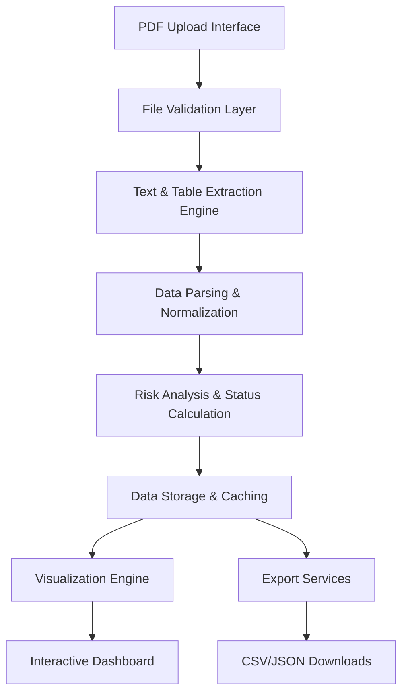

# Design Document

## Overview

InfraTrack AI is designed as a modular, scalable web application that transforms unstructured infrastructure PDF reports into structured, actionable intelligence. The system follows a layered architecture with clear separation of concerns between data extraction, processing, analysis, and presentation layers.

The platform is built using Streamlit for rapid prototyping and deployment, with a backend processing pipeline that can be easily extended to support cloud-native architectures and enterprise-scale deployments.

## Architecture

### High-Level Architecture



### System Layers

1. **Presentation Layer**: Streamlit web interface with interactive components
2. **Processing Layer**: PDF extraction, parsing, and analysis modules
3. **Data Layer**: In-memory data structures with export capabilities
4. **Visualization Layer**: Chart generation and dashboard rendering

## Components and Interfaces

### 1. File Upload and Validation Component

**Purpose**: Handle PDF file uploads and validate file integrity

**Interface**:
```python
class FileUploadHandler:
    def validate_file(self, uploaded_file) -> bool
    def get_file_metadata(self, uploaded_file) -> dict
    def handle_upload_errors(self, error) -> str
```

**Implementation**: 
- Uses Streamlit's `file_uploader` widget
- Validates file type, size, and basic PDF structure
- Provides user feedback for upload status

### 2. Text and Table Extraction Engine

**Purpose**: Extract raw text and tabular data from PDF documents

**Interface**:
```python
class ExtractionEngine:
    def extract_text_and_tables(self, pdf_source) -> dict
    def extract_text(self, page) -> str
    def extract_tables(self, page) -> list
    def handle_extraction_errors(self, error) -> None
```

**Implementation**:
- Uses `pdfplumber` library for robust PDF processing
- Handles both text-based and scanned PDFs
- Extracts structured tables alongside narrative text
- Provides fallback mechanisms for corrupted files

### 3. Data Parsing and Normalization Module

**Purpose**: Convert raw extracted data into structured project information

**Interface**:
```python
class DataParser:
    def parse_project_info(self, text: str, tables: list) -> dict
    def extract_project_metadata(self, text: str) -> dict
    def parse_numerical_data(self, tables: list) -> dict
    def normalize_field_values(self, raw_data: dict) -> dict
```

**Implementation**:
- Multi-strategy parsing using regex patterns and table scanning
- Handles various PDF formats and layouts
- Normalizes currency and percentage values
- Generates unique project identifiers

### 4. Risk Analysis and Status Engine

**Purpose**: Calculate project health metrics and assign status flags

**Interface**:
```python
class RiskAnalyzer:
    def calculate_project_status(self, progress_data: dict) -> str
    def detect_delays(self, physical_progress: float) -> bool
    def detect_cost_overruns(self, expenditure: float, planned_cost: float) -> bool
    def generate_risk_score(self, project_data: dict) -> float
```

**Implementation**:
- Rule-based status calculation (ON_TRACK, DELAYED, COST_OVERRUN)
- Configurable thresholds for delay and cost overrun detection
- Multi-factor risk scoring algorithm

### 5. Visualization and Dashboard Engine

**Purpose**: Generate interactive charts and dashboard components

**Interface**:
```python
class VisualizationEngine:
    def create_progress_chart(self, project_data: dict) -> plotly.Figure
    def create_cost_analysis_chart(self, project_data: dict) -> plotly.Figure
    def generate_summary_metrics(self, project_data: dict) -> dict
    def create_status_indicators(self, status: str) -> dict
```

**Implementation**:
- Uses Plotly for interactive charts
- Responsive design with Streamlit columns
- Color-coded status indicators
- Real-time chart updates

### 6. Export Services Module

**Purpose**: Generate downloadable structured data files

**Interface**:
```python
class ExportService:
    def generate_csv_export(self, data: dict) -> bytes
    def generate_json_export(self, data: dict) -> bytes
    def create_batch_export(self, multiple_projects: list) -> bytes
    def validate_export_data(self, data: dict) -> bool
```

**Implementation**:
- Pandas DataFrame conversion for CSV exports
- JSON serialization with proper formatting
- Batch processing capabilities for multiple projects
- Data validation before export

## Data Models

### Project Data Schema

```python
@dataclass
class ProjectData:
    project_id: str
    project_name: Optional[str]
    sector: Optional[str]
    state: Optional[str]
    district: Optional[str]
    report_month: Optional[str]
    physical_progress_percent: Optional[float]
    financial_progress_percent: Optional[float]
    planned_cost_crore: Optional[float]
    expenditure_till_date_crore: Optional[float]
    status_flag: str
    source_file: str
    extraction_confidence: Optional[float]
    created_at: datetime
```

### Extraction Result Schema

```python
@dataclass
class ExtractionResult:
    text: str
    tables: List[List[str]]
    metadata: dict
    extraction_time: float
    success: bool
    errors: List[str]
```

### Risk Assessment Schema

```python
@dataclass
class RiskAssessment:
    overall_status: str
    delay_risk: bool
    cost_overrun_risk: bool
    risk_score: float
    confidence_level: str
    assessment_factors: List[str]
```

## Error Handling

### Error Categories and Handling Strategies

1. **File Upload Errors**
   - Invalid file format: Display user-friendly error with supported formats
   - File size exceeded: Show size limits and compression suggestions
   - Corrupted files: Provide file repair recommendations

2. **PDF Processing Errors**
   - OCR failures: Fallback to alternative extraction methods
   - Encrypted PDFs: Request password or suggest decryption
   - Malformed PDFs: Attempt partial extraction with warnings

3. **Data Parsing Errors**
   - Missing required fields: Flag for manual review
   - Invalid data formats: Apply data cleaning and normalization
   - Ambiguous values: Provide confidence scores and alternatives

4. **System Errors**
   - Memory limitations: Implement streaming processing for large files
   - Processing timeouts: Break down into smaller chunks
   - Network issues: Implement retry mechanisms with exponential backoff

### Error Recovery Mechanisms

```python
class ErrorHandler:
    def handle_extraction_failure(self, error: Exception) -> dict
    def provide_fallback_parsing(self, raw_data: str) -> dict
    def log_processing_errors(self, error_details: dict) -> None
    def generate_error_report(self, session_errors: list) -> str
```

## Testing Strategy

### Unit Testing

- **Extraction Module Tests**: Validate PDF processing with various file formats
- **Parser Module Tests**: Test regex patterns and table parsing logic
- **Utility Function Tests**: Verify status calculation and ID generation
- **Data Validation Tests**: Ensure schema compliance and data integrity

### Integration Testing

- **End-to-End Workflow Tests**: Complete PDF upload to export process
- **Cross-Module Integration**: Verify data flow between components
- **Error Handling Tests**: Validate error recovery mechanisms
- **Performance Tests**: Measure processing time for various file sizes

### Test Data Strategy

```python
class TestDataGenerator:
    def generate_sample_pdf(self, project_type: str) -> bytes
    def create_malformed_pdf(self, error_type: str) -> bytes
    def generate_test_project_data(self, scenario: str) -> dict
    def create_batch_test_files(self, count: int) -> List[bytes]
```

### Automated Testing Pipeline

1. **Continuous Integration**: Run tests on every code commit
2. **Regression Testing**: Validate against known good outputs
3. **Performance Benchmarking**: Track processing speed improvements
4. **User Acceptance Testing**: Validate UI/UX with sample users

## Scalability and Performance Considerations

### Current Architecture Limitations

- Single-threaded processing for PDF extraction
- In-memory data storage limits batch processing
- Streamlit session state limitations for large datasets

### Scalability Enhancements

1. **Asynchronous Processing**
   ```python
   async def process_multiple_files(self, files: List[bytes]) -> List[dict]:
       tasks = [self.process_single_file(file) for file in files]
       return await asyncio.gather(*tasks)
   ```

2. **Caching Layer**
   - Redis for session data persistence
   - File-based caching for processed results
   - Intelligent cache invalidation strategies

3. **Database Integration**
   - PostgreSQL for structured project data
   - MongoDB for document storage and metadata
   - Time-series database for trend analysis

### Performance Optimization

- Lazy loading for large datasets
- Pagination for dashboard views
- Compressed data transfer formats
- Client-side caching for static assets

## Security Considerations

### Data Protection

- File upload size limits and type validation
- Sanitization of extracted text content
- Secure temporary file handling
- Data encryption for sensitive information

### Access Control

- Session-based user isolation
- Role-based access for enterprise deployments
- Audit logging for data access and modifications
- Secure API endpoints for programmatic access

### Privacy Compliance

- Automatic PII detection and masking
- Data retention policies
- User consent management
- GDPR compliance for international deployments