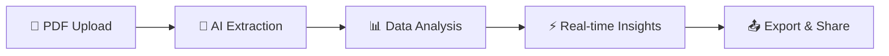
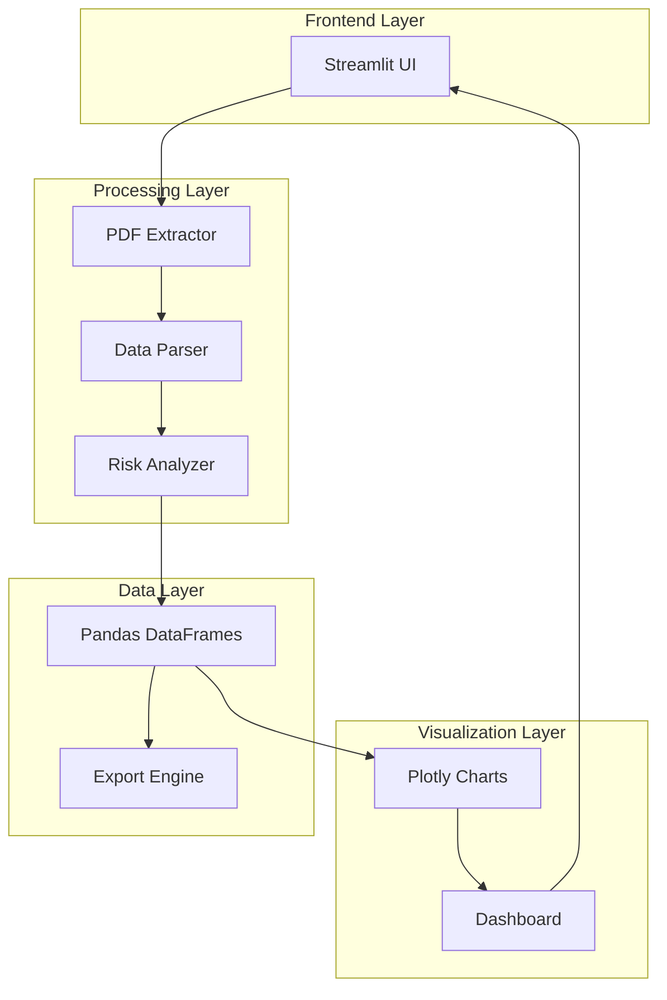
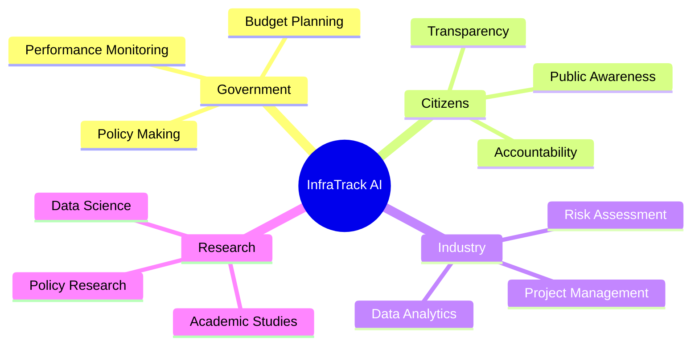

<div align="center">

# 🏗️ InfraTrack AI

### *Transforming Infrastructure Intelligence with AI*

[](https://infratechai.streamlit.app/)
[](https://python.org)
[](https://opensource.org/licenses/MIT)
[](https://github.com/akshitag001/infratrack-ai)

**🚀 AI-Powered Infrastructure Progress Extractor & Monitor**

*Converting unstructured government PDFs into actionable intelligence*

[🌟 **Live Demo**](https://infratechai.streamlit.app/) • [📖 **Documentation**](#-getting-started) • [🎯 **Features**](#-key-features) • [🔧 **Installation**](#-getting-started)

</div>

---

## 🎯 Problem Statement

<div align="center">

</div>

Government infrastructure progress reports (such as those published on **PAIMANA portals**) are released mainly as PDFs and semi-structured documents.

> 📊 While this data is technically **public**, it is **not machine-readable**, difficult to analyze, and almost impossible to track over time without manual effort.

### 🚨 Key Challenges

<table>
<tr>
<td align="center">⏰</td>
<td><strong>No Real-time Monitoring</strong><br/>Manual tracking leads to delayed insights</td>
</tr>
<tr>
<td align="center">🔍</td>
<td><strong>Hidden Delays & Overruns</strong><br/>No automated detection of project issues</td>
</tr>
<tr>
<td align="center">📈</td>
<td><strong>Fragmented Data</strong><br/>No unified dataset for analytics or dashboards</td>
</tr>
</table>

---

## 💡 Our Solution

<div align="center">

</div>

**InfraTrack AI** is a lightweight, AI-assisted system that converts unstructured government infrastructure PDFs into clean, structured data and instantly visualizes project health.

### 🎯 What It Does

<div align="center">



</div>

| Step | Action | Result |
|------|--------|--------|
| 1️⃣ | **Upload** PDF reports | Instant file processing |
| 2️⃣ | **Extract** key project fields | Automated data parsing |
| 3️⃣ | **Standardize** into unified schema | Clean, structured data |
| 4️⃣ | **Detect** delays and cost overruns | Smart status flagging |
| 5️⃣ | **Export** structured datasets | CSV + JSON downloads |
| 6️⃣ | **Visualize** progress analytics | Interactive dashboards |

---

## ✨ Key Features

<div align="center">

</div>

### 🎨 **Smart PDF Processing**
<details>
<summary>📄 <strong>Intelligent Upload Interface</strong></summary>

- Drag-and-drop PDF upload
- Real-time file validation
- Support for PAIMANA-style reports
- Batch processing capabilities

</details>

### 🤖 **AI-Powered Data Extraction**
<details>
<summary>🔍 <strong>Automated Field Detection</strong></summary>

| Field | Description | Format |
|-------|-------------|--------|
| 🏗️ **Project Name** | Infrastructure project identifier | Text |
| 🏢 **Sector** | Project category/domain | Text |
| 📍 **Location** | State & District information | Geographic |
| 📅 **Report Month** | Reporting period | Date |
| 📊 **Physical Progress** | Construction completion % | Percentage |
| 💰 **Financial Progress** | Budget utilization % | Percentage |
| 💵 **Planned Cost** | Total project budget | ₹ Crores |
| � **Etxpenditure** | Amount spent to date | ₹ Crores |

</details>

### 📈 **Advanced Analytics & Visualization**
<details>
<summary>📊 <strong>Interactive Dashboards</strong></summary>

- **Progress Comparison Charts**: Physical vs Financial progress
- **Cost Analysis Graphs**: Planned vs Actual expenditure
- **Trend Analysis**: Multi-project comparisons
- **Risk Heatmaps**: Visual project health indicators

</details>

### 🚨 **Intelligent Status Flagging**
<details>
<summary>⚠️ <strong>Automated Risk Detection</strong></summary>

| Status | Indicator | Criteria |
|--------|-----------|----------|
| ✅ `ON_TRACK` | 🟢 Green | Progress aligned with budget |
| ⏰ `DELAYED` | 🟡 Yellow | Physical progress lagging |
| 💸 `COST_OVERRUN` | 🟠 Orange | Expenditure exceeds budget |
| 🚨 `CRITICAL` | 🔴 Red | Both delayed and over-budget |

</details>

### 📤 **Multi-Format Export System**
<details>
<summary>💾 <strong>Flexible Data Export</strong></summary>

- **CSV Format**: Spreadsheet-ready data
- **JSON Format**: API-compatible structure
- **Batch Export**: Multiple projects at once
- **Custom Templates**: Configurable output formats

</details>

### 🔍 **Transparency & Debugging**
<details>
<summary>🛠️ <strong>Raw Data Access</strong></summary>

- **Raw Text Viewer**: Inspect extracted content
- **Confidence Scores**: AI extraction reliability
- **Processing Logs**: Detailed operation history
- **Manual Override**: Correct extraction errors

</details>

---

## 📐 Unified Data Schema

<div align="center">

</div>

InfraTrack AI standardizes every report into a **consistent, machine-readable format**:

```json
{
  "project_id": "PROJ-ABC123",
  "project_name": "Smart City Infrastructure Development",
  "sector": "Urban Development",
  "state": "Maharashtra",
  "district": "Mumbai",
  "report_month": "December 2024",
  "physical_progress_percent": 75.5,
  "financial_progress_percent": 68.2,
  "planned_cost_crore": 150.0,
  "expenditure_till_date_crore": 102.3,
  "status_flag": "ON_TRACK",
  "source_file": "mumbai_infrastructure_dec2024.pdf"
}
```

### 🎯 Schema Benefits

| Benefit | Description |
|---------|-------------|
| 🔄 **Consistency** | Same format across all reports |
| 🤖 **Machine Readable** | Ready for APIs and databases |
| 📊 **Analytics Ready** | Direct input for BI tools |
| 🔗 **Interoperable** | Works with existing systems |

---

##  How It Works


---

## 🔧 Tech Stack

<div align="center">

</div>

<div align="center">

| Category | Technology | Purpose |
|----------|------------|---------|
| 🎨 **Frontend** |  | Interactive web interface |
| 🐍 **Backend** |  | Core application logic |
| 📄 **PDF Processing** |  | Text & table extraction |
| 📊 **Data Handling** |  | Data manipulation |
| 📈 **Visualization** |  | Interactive charts |
| 🧠 **AI/ML** |  | Intelligent parsing |

</div>

### 🏗️ Architecture Overview



---

## 🚀 Getting Started

<div align="center">

</div>

### 📋 Prerequisites

- **Python 3.8+** installed on your system
- **Git** for cloning the repository
- **Internet connection** for dependency installation

### ⚡ Quick Setup

<details>
<summary><strong>🔽 Click to expand setup instructions</strong></summary>

#### 1️⃣ **Clone the Repository**

```bash
# Clone the project
git clone https://github.com/akshitag001/infratrack-ai.git

# Navigate to project directory
cd infratrack-ai
```

#### 2️⃣ **Set Up Virtual Environment** (Recommended)

```bash
# Create virtual environment
python -m venv venv

# Activate virtual environment
# On Windows:
venv\Scripts\activate
# On macOS/Linux:
source venv/bin/activate
```

#### 3️⃣ **Install Dependencies**

```bash
# Install required packages
pip install -r requirements.txt
```

#### 4️⃣ **Launch the Application**

```bash
# Start the Streamlit app
streamlit run app.py
```

#### 5️⃣ **Access the Application**

Open your browser and navigate to:
```
http://localhost:8501
```

</details>

### 🎮 **How to Use**

<div align="center">

| Step | Action | Description |
|------|--------|-------------|
| 1️⃣ | **📤 Upload** | Drop your PAIMANA PDF into the upload area |
| 2️⃣ | **⏳ Process** | Watch AI extract and analyze your data |
| 3️⃣ | **📊 Analyze** | Review progress charts and risk indicators |
| 4️⃣ | **💾 Export** | Download structured data in CSV/JSON format |

</div>

### 🎯 **Sample Data**

Don't have a PDF? No problem! Download our sample file to test the system:

```bash
# Sample file included in the repository
tests/sample_report.pdf
```

---

## 🎯 Use Cases & Applications

<div align="center">

</div>

<div align="center">

| 🏛️ **Government** | 🏢 **Enterprise** | 🌐 **Public** |
|-------------------|-------------------|----------------|
| Real-time monitoring dashboards | Infrastructure project audits | Public transparency portals |
| Policy analytics & reporting | Delay and cost overrun detection | Open data standardization |
| Budget allocation optimization | Contractor performance tracking | Citizen engagement platforms |

</div>

### 🌟 **Impact Areas**



---

## � Hackatthon Context

<div align="center">

</div>

> 🎯 **Challenge**: Public Data Extraction & Structuring

This prototype demonstrates how **unstructured government documents** can be transformed into **AI-ready datasets** for real-time monitoring and decision-making.

### 🎖️ **Achievement Highlights**

- ✅ **Problem Solved**: Automated PDF-to-data conversion
- ✅ **Impact Created**: Real-time infrastructure monitoring
- ✅ **Innovation**: AI-powered government transparency
- ✅ **Scalability**: Ready for nationwide deployment

---

## 🚀 Future Roadmap

<div align="center">

</div>

### 🎯 **Phase 1: Enhanced Processing**
- [ ] 📄 Multi-PDF batch processing
- [ ] 🔍 OCR support for scanned documents
- [ ] 🌐 Indic language extraction capabilities
- [ ] 🤖 Advanced AI/ML models for better accuracy

### 🎯 **Phase 2: Advanced Analytics**
- [ ] 📍 Geo-mapping of project locations
- [ ] 📈 Time-series trend analysis
- [ ] 🚨 AI-based anomaly detection
- [ ] 📊 Predictive project outcome modeling

### 🎯 **Phase 3: Enterprise Features**
- [ ] 🔌 REST API for government portals
- [ ] 🏢 Multi-tenant architecture
- [ ] 🔐 Advanced security and compliance
- [ ] 📱 Mobile application for field officers

### 🎯 **Phase 4: Ecosystem Integration**
- [ ] 🌐 Integration with existing government systems
- [ ] 📡 Real-time data streaming capabilities
- [ ] 🤝 Third-party API integrations
- [ ] 🎯 Custom dashboard builder

---

## 🤝 Contributing

<div align="center">

</div>

We welcome contributions from the community! Here's how you can help:

### 🛠️ **Ways to Contribute**

- 🐛 **Bug Reports**: Found an issue? Let us know!
- 💡 **Feature Requests**: Have an idea? We'd love to hear it!
- 📝 **Documentation**: Help improve our docs
- 🧪 **Testing**: Test with different PDF formats
- 💻 **Code**: Submit pull requests for new features

### 📋 **Development Setup**

1. Fork the repository
2. Create a feature branch: `git checkout -b feature-name`
3. Make your changes and test thoroughly
4. Submit a pull request with a clear description

---

## 📄 License

<div align="center">

</div>

This project is licensed under the **MIT License** - see the [LICENSE](LICENSE) file for details.

---

## 🙏 Acknowledgments

<div align="center">

</div>

- 🏛️ **Government of India** for open data initiatives
- 🤖 **Streamlit Team** for the amazing framework
- 📄 **pdfplumber** developers for robust PDF processing
- 🌟 **Open Source Community** for continuous inspiration

---

<div align="center">

## 🌟 **Star this repository if you found it helpful!**

[](https://github.com/akshitag001/infratrack-ai/stargazers)
[](https://github.com/akshitag001/infratrack-ai/network/members)

### 📧 **Contact & Support**

Have questions? Reach out to us:

[](https://github.com/akshitag001)
[](mailto:your-email@example.com)

---

> **InfraTrack AI** — *Transforming public infrastructure data into real-time, actionable intelligence for a better tomorrow.*

**Made with ❤️ for Digital India 🇮🇳**

</div>
